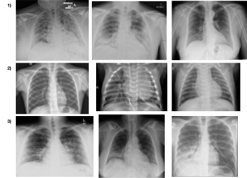

# Applications of Convolutional Neural Networks in Chest X-Ray Analyses for the Detection of COVID-19

	
	 
	<em>Example CXRs from our modified dataset.</em>

Throughout global efforts to defend against the spread of COVID-19 from late 2019 up until now, one of the most crucial factors that has helped combat the pandemic is the development of various screening methods to detect the presence of COVID-19 as conveniently and accurately as possible. One of such methods is the utilization of chest X-Rays (CXRs) to detect anomalies that are concurrent with a patient infected with COVID-19. While yielding results much faster than the traditional RT-PCR test, CXRs tend to be less accurate. Realizing this issue, in our research, we investigated the applications of computer vision in order to better detect COVID-19 from CXRs. Coupled with an extensive image database of CXRs of healthy patients, patients with non-COVID-19 induced pneumonia, and patients positive with COVID-19, convolutional neural networks (CNNs) prove to possess the ability to easily and accurately identify whether or not a patient is infected with COVID-19 in a matter of seconds. Borrowing and adjusting the architectures of three well-tested CNNs: VGG-16, ResNet50, and MobileNetV2, we performed transfer learning and trained three of our own models, then compared and contrasted their differing precisions, accuracies, and efficiencies in correctly labeling patients with and without COVID-19. In the end, all of our models were able to accurately categorize at least 94% of the CXRs, with some performing better than the others; these differences in performance were largely due to the contrasting architectures each of our models borrowed from the three respective CNNs.

To access and learn more about the models we trained, click [here](https://github.com/kevinjl321/cxr-net/blob/master/docs/models.md).

To access and learn more about the dataset we used, click [here](https://github.com/kevinjl321/cxr-net/blob/master/docs/dataset.md).

# Research Team

 - Kevin Lan, San Marino High School (kevinlan321@gmail.com)
 - Anish Kasam, Dublin High School (anishkasam@gmail.com)
 - Patrick Ting, San Ramon Valley High School (tingpatrick2@gmail.com)

# Acknowledgements

We would like to express our gratitude to our supervisors and instructors: Ryan Solgi, Laboni Sarker, and S. Shailja who guided us and provided us with valuable insight throughout this project. We would also like to thank Dr. Lina Kim and all of those who are involved with UC Santa Barbara’s Summer Research Academies for providing us with the opportunity and environment to conduct this research.

# Results and Findings

To read more about our research process as well as conclusions and results collected, read our [published article](https://www.biomedscijournal.com/articles/abse-aid1015.pdf)
